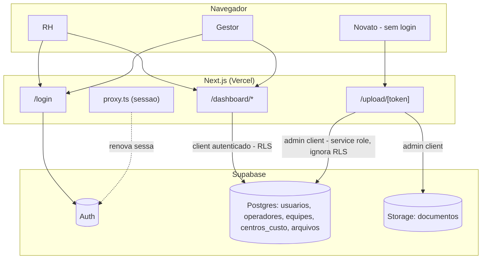
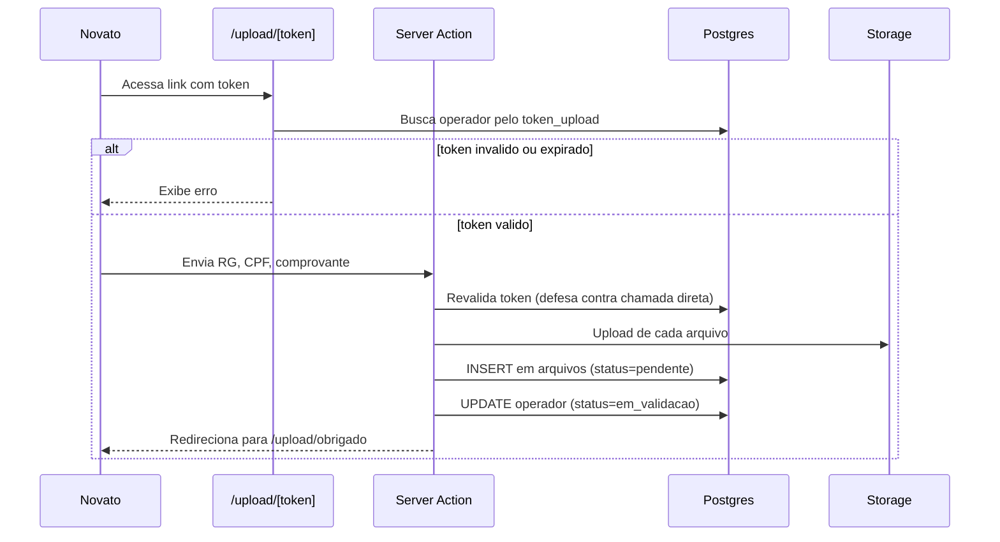

# Arquitetura

## Visão geral dos componentes

```mermaid
graph TB
    subgraph Navegador
        RH[RH]
        Gestor[Gestor]
        Novato[Novato - sem login]
    end

    subgraph NextJS["Next.js (Vercel)"]
        Login["/login"]
        Dash["/dashboard/*"]
        Upload["/upload/[token]"]
        Proxy["proxy.ts (sessao)"]
    end

    subgraph Supabase
        Auth[(Auth)]
        DB[(Postgres: usuarios, operadores, equipes, centros_custo, arquivos)]
        Storage[(Storage: documentos)]
    end

    RH --> Login
    Gestor --> Login
    Login --> Auth
    Proxy -.renova sessao.-> Auth

    RH --> Dash
    Gestor --> Dash
    Dash -->|client autenticado - RLS| DB

    Novato --> Upload
    Upload -->|admin client - service role, ignora RLS| DB
    Upload -->|admin client| Storage
```

## Fluxo de upload de documentos (ADR 001)

```mermaid
sequenceDiagram
    participant N as Novato
    participant U as /upload/[token]
    participant SA as Server Action
    participant DB as Postgres
    participant ST as Storage

    N->>U: Acessa link com token
    U->>DB: Busca operador pelo token_upload
    alt token invalido ou expirado
        U-->>N: Exibe erro
    else token valido
        N->>SA: Envia RG, CPF, comprovante
        SA->>DB: Revalida token (defesa contra chamada direta)
        SA->>ST: Upload de cada arquivo
        SA->>DB: INSERT em arquivos (status=pendente)
        SA->>DB: UPDATE operador (status=em_validacao)
        SA-->>N: Redireciona para /upload/obrigado
    end
```